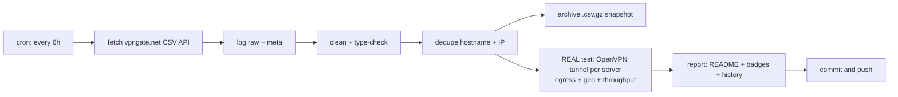

# 🛡️ VPN Gate Monitor

> **Every 6 hours** this repo fetches the complete public [VPN Gate](https://www.vpngate.net/en/) server list, **cleans, deduplicates and archives** it — and then does the part that matters: it **opens a real OpenVPN tunnel to every single listed server**, verifies that traffic genuinely exits through it, checks *where* it exits, and measures real download throughput.
>
> **Everything below this line is the auto-generated living report. No hand-edited numbers.**

[](https://github.com/G1010yzd10/vpngate-monitor/actions/workflows/vpngate.yml)
[](https://raw.githubusercontent.com/G1010yzd10/vpngate-monitor/main/badges/servers.json)
[](https://raw.githubusercontent.com/G1010yzd10/vpngate-monitor/main/badges/alive.json)
[](https://raw.githubusercontent.com/G1010yzd10/vpngate-monitor/main/badges/speed.json)
[](https://raw.githubusercontent.com/G1010yzd10/vpngate-monitor/main/badges/updated.json)

## 📊 Latest results

| | |
|---|---|
| **Run** | [#2 · view run](https://github.com/G1010yzd10/vpngate-monitor/actions/runs/36523047021) · 2026-09-29 04:45:58 UTC · trigger: `push` |
| **Servers fetched (unique)** | **93** |
| **Duplicates removed** | 0 exact + 0 same-IP |
| **Servers tested** | **180 of 180** — all 93 current + 87 historical (every server seen in the API within 30 days) |
| **✅ Verified alive** (tunnel up + egress proven) | **126** — 64 from the current list + 62 historical ♻️ |
| **❌ Dead / unusable** | 54 |
| **Usability** | **68.8%** of everything VPN Gate lists right now actually works |
| **⚡ Measured speed (avg / median / max)** | **11.4 / 13.0 / 53.6 Mbps** |
| **🚀 Fastest verified** | **vpn908512202** · 🇺🇸 United States · **53.6 Mbps** |
| **🧭 Exit-country mismatches** | 2 (server exits somewhere else than it claims) |
| **🤝 Handshake time (alive, avg)** | 2.9 s |

## 🚀 Fastest verified servers

| # | Server | Country | List | Endpoint | Handshake | Measured ↓ | Claimed ↓ | Score |
|---:|---|---|---|---|---:|---:|---:|---:|
| 1 | `vpn908512202` | 🇺🇸 United States | 📋 current | `162.224.160.11:1423`/tcp | 1.8s | **53.6 Mbps** | 0.0 Mbps | 730,079 |
| 2 | `vpn693017146` | 🇯🇵 Japan | 📋 current | `218.131.41.95:1975`/udp | 2.3s | **22.6 Mbps** | 2,558.8 Mbps | 599,858 |
| 3 | `vpn767479473` | 🇰🇷 Korea Republic of | ♻️ historical | `211.226.144.221:1195`/udp | 2.5s | **19.9 Mbps** | 94.7 Mbps | 1,355,215 |
| 4 | `vpn133692637` | 🇯🇵 Japan | 📋 current | `219.104.35.195:1451`/tcp | 2.5s | **19.5 Mbps** | 939.4 Mbps | 755,228 |
| 5 | `vpn764449825` | 🇲🇽 Mexico | 📋 current | `201.142.133.52:1412`/tcp | 2.3s | **19.4 Mbps** | 39.7 Mbps | 612,996 |
| 6 | `vpn176833325` | 🇯🇵 Japan | ♻️ historical | `60.107.188.86:1480`/tcp | 2.8s | **17.1 Mbps** | 395.4 Mbps | 936,586 |
| 7 | `vpn306037816` | 🇯🇵 Japan | 📋 current | `59.142.40.235:1724`/tcp | 2.5s | **16.8 Mbps** | 543.2 Mbps | 619,716 |
| 8 | `vpn257845930` | 🇯🇵 Japan | 📋 current | `115.36.211.48:1256`/tcp | 2.3s | **16.8 Mbps** | 968.0 Mbps | 647,342 |
| 9 | `vpn127203103` | 🇯🇵 Japan | 📋 current | `58.70.120.185:1621`/tcp | 2.8s | **16.6 Mbps** | 286.2 Mbps | 741,334 |
| 10 | `public-vpn-113` | 🇯🇵 Japan | 📋 current | `219.100.37.100:443`/tcp | 3.0s | **16.4 Mbps** | 282.1 Mbps | 2,297,130 |

*Measured = 5 MB download through the live tunnel to speed.cloudflare.com. Claimed = the server's self-reported line speed in the VPN Gate API. 'Historical' servers are no longer in the API's current top list but still answered our tunnel — we keep re-testing everything we have ever seen.*

## ⭐ Top-scored & verified alive

| # | Server | Country | Score | Claimed ↓ | Measured ↓ | Sessions | Uptime | Log policy |
|---:|---|---|---:|---:|---:|---:|---:|---|
| 1 | `public-vpn-48` | 🇯🇵 JP | 3,016,353 | 949.2 Mbps | 14.3 Mbps | 107 | 126.5 d | 2weeks |
| 2 | `public-vpn-72` | 🇯🇵 JP | 2,981,318 | 602.0 Mbps | 15.6 Mbps | 143 | 126.5 d | 2weeks |
| 3 | `public-vpn-201` | 🇯🇵 JP | 2,851,535 | 237.9 Mbps | 4.6 Mbps | 79 | 126.5 d | 2weeks |
| 4 | `public-vpn-137` | 🇯🇵 JP | 2,811,720 | 1,442.8 Mbps | 16.0 Mbps | 153 | 126.5 d | 2weeks |
| 5 | `public-vpn-189` | 🇯🇵 JP | 2,735,182 | 1,019.0 Mbps | 2.1 Mbps | 113 | 126.5 d | 2weeks |
| 6 | `public-vpn-195` | 🇯🇵 JP | 2,726,282 | 958.6 Mbps | 8.7 Mbps | 105 | 126.5 d | 2weeks |
| 7 | `public-vpn-113` | 🇯🇵 JP | 2,297,130 | 282.1 Mbps | 16.4 Mbps | 81 | 126.5 d | 2weeks |
| 8 | `public-vpn-138` | 🇯🇵 JP | 2,118,376 | 802.3 Mbps | 13.3 Mbps | 81 | 126.5 d | 2weeks |
| 9 | `public-vpn-121` | 🇯🇵 JP | 1,897,675 | 462.5 Mbps | 15.9 Mbps | 70 | 126.5 d | 2weeks |
| 10 | `public-vpn-258` | 🇯🇵 JP | 1,864,979 | 665.6 Mbps | 1.2 Mbps | 38 | 126.5 d | 2weeks |

## 🌍 Countries

| Country | Servers | Verified alive | Best measured ↓ | Fastest server |
|---|---:|---:|---:|---|
| 🇯🇵 Japan (JP) | 89 | 64 | 22.6 Mbps | `vpn693017146` |
| 🇰🇷 Korea Republic of (KR) | 50 | 41 | 19.9 Mbps | `vpn767479473` |
| 🇹🇭 Thailand (TH) | 13 | 9 | 15.5 Mbps | `vpn198522121` |
| 🇷🇺 Russian Federation (RU) | 11 | 2 | 12.0 Mbps | `vpn723983095` |
| 🇺🇸 United States (US) | 7 | 4 | 53.6 Mbps | `vpn908512202` |
| 🇭🇷 Croatia (LOCAL Name: Hrvatska) (HR) | 3 | 2 | 0.8 Mbps | `vpn118469396` |
| 🇨🇦 Canada (CA) | 1 | 1 | 2.6 Mbps | `vpn397851595` |
| 🇨🇭 Switzerland (CH) | 1 | 0 | 0.0 Mbps | `` |
| 🇨🇴 Colombia (CO) | 1 | 0 | 0.0 Mbps | `` |
| 🇬🇩 Grenada (GD) | 1 | 1 | 3.0 Mbps | `diamondgnd` |
| 🇲🇽 Mexico (MX) | 1 | 1 | 19.4 Mbps | `vpn764449825` |
| 🇵🇪 Peru (PE) | 1 | 1 | 10.0 Mbps | `vpn593486731` |
| 🇻🇳 Viet Nam (VN) | 1 | 0 | 0.0 Mbps | `` |

## 🕵️ Claim vs. reality

The VPN Gate `Speed` field is whatever the server *claims*. Here is the truth, measured through a live tunnel — the hall of shame (claimed ≫ delivered):

| Server | Country | Claims | Delivers | Reality ratio |
|---|---|---:|---:|---:|
| `vpn698373679` | 🇰🇷 KR | 94 Mbps | 0.2 Mbps | 0% |
| `public-vpn-258` | 🇯🇵 JP | 666 Mbps | 1.2 Mbps | 0% |
| `public-vpn-189` | 🇯🇵 JP | 1,019 Mbps | 2.1 Mbps | 0% |
| `vpn981288372` | 🇯🇵 JP | 46 Mbps | 0.1 Mbps | 0% |
| `vpn178522347` | 🇭🇷 HR | 202 Mbps | 0.8 Mbps | 0% |
| `vpn175155645` | 🇯🇵 JP | 159 Mbps | 0.7 Mbps | 0% |
| `vpn588948343` | 🇰🇷 KR | 350 Mbps | 2.8 Mbps | 1% |
| `vpn693017146` | 🇯🇵 JP | 2,559 Mbps | 22.6 Mbps | 1% |
| `public-vpn-195` | 🇯🇵 JP | 959 Mbps | 8.7 Mbps | 1% |
| `vpn755967672` | 🇯🇵 JP | 121 Mbps | 1.2 Mbps | 1% |

Most honest of this round: `vpn408435278` (13 Mbps), `vpn464162121` (15 Mbps), `vpn764449825` (19 Mbps), `vpn993504359` (14 Mbps), `vpn137812529` (5 Mbps).

## 🧭 Exit-country mismatches

These servers are listed under one country but your traffic **actually exits somewhere else** (verified via Cloudflare's geo view of the exit IP) — useful to know before you trust one:

| Server | Claims | Actually exits via | Exit IP | Measured ↓ |
|---|---|---|---|---:|
| `vpn118469396` | 🇭🇷 HR | 🇧🇬 BG | `150.40.105.23` | 0.8 Mbps |
| `vpn178522347` | 🇭🇷 HR | 🇧🇬 BG | `150.40.105.17` | 0.8 Mbps |

## 📈 History

History builds up here run by run (currently 1 entry).

## ⚙️ How the pipeline works



1. **Fetch** — `GET /api/iphone/` with retries and endpoint fallback; responses are validated (the API sometimes serves an empty placeholder page to datacenter IPs) and the raw bytes are logged and hashed (sha256).
2. **Clean** — parse the special CSV (`*vpn_servers` marker, `#`-prefixed header), type-check every numeric field, validate IPs, drop broken rows, strip noise.
3. **Dedupe** — remove exact `(HostName, IP)` duplicates, then same-IP entries keeping the highest-scoring one.
4. **Archive** — every run writes an immutable gzipped snapshot to `archive/` (auto-pruned to the newest 360 ≈ 90 days).
5. **Test — the real deal.** For **every** server, every run — not just the API's current list, but **the union of every server that has ever appeared** within the 30-day recall window (kept in `data/known_servers.json`): decode the shared VPN Gate OpenVPN template (all servers ship the same CA + dummy client cert — verified), rebuild each server's config with its remembered `(proto, port)`, force it onto a per-worker `tun` device, disable pushed routes, pin two /32 routes through the tunnel to per-worker Cloudflare anycast IPs, wait for *Initialization Sequence Completed*, then verify egress (`cdn-cgi/trace` through the tunnel must return a foreign exit IP + real exit country) and measure a 5 MB download through the same tunnel. Up to 48 isolated tunnels run in parallel; a server that never completes the handshake is hard-killed after 25 s.
6. **Report** — this README, four live badges, `latest.json`, `summary.json` and the `history.jsonl` log are regenerated and committed by `github-actions[bot]`.

## 📁 Data files & programmatic use

All results are in this repo — hotlink them straight from `https://github.com/G1010yzd10/vpngate-monitor`:

- [`data/latest.json`](https://raw.githubusercontent.com/G1010yzd10/vpngate-monitor/main/data/latest.json) — the merged dataset: every cleaned server + its latest real test result
- [`data/servers_clean.csv`](https://raw.githubusercontent.com/G1010yzd10/vpngate-monitor/main/data/servers_clean.csv) — cleaned, deduplicated server list (no bulky config blobs)
- [`data/summary.json`](https://raw.githubusercontent.com/G1010yzd10/vpngate-monitor/main/data/summary.json) — compact run summary with failure breakdown
- [`data/history.jsonl`](https://raw.githubusercontent.com/G1010yzd10/vpngate-monitor/main/data/history.jsonl) — one JSON line per run, append-only
- [`archive/`](https://github.com/G1010yzd10/vpngate-monitor/tree/main/archive) — immutable gzipped snapshots of every run
- full logs, raw API response and per-server error details are attached to each [Actions run](https://github.com/G1010yzd10/vpngate-monitor/actions) as artifacts (30-day retention)

Grab a working VPN right now:

```bash
curl -s https://raw.githubusercontent.com/G1010yzd10/vpngate-monitor/main/data/latest.json \
  | python3 -c "import json,sys;[print(s['IP'],s['CountryShort'],s['test']['download_mbps'],'Mbps') for s in json.load(sys.stdin) if s['test'] and s['test']['alive']]" \
  | sort -k3 -nr | head
```

Field units: `Score` points · `Ping` ms · `Speed` bit/s (self-reported) · `Uptime` ms · `TotalUsers` count · `TotalTraffic` bytes · `download_mbps` Mbps (measured through the tunnel).

## 🔬 Methodology & caveats

- **Real tunnels, not CSV checks.** A server only counts as alive if OpenVPN completed its handshake *and* an HTTPS request bound to the tunnel egressed with a foreign IP. A server whose tunnel silently black-holes traffic fails the egress step and is reported dead.
- **No DNS through the VPN.** Test destinations are pinned with `curl --resolve` to per-worker Cloudflare anycast addresses, so a broken/hijacking VPN DNS can never fake a success.
- **Throughput** is one 5 MB download to `speed.cloudflare.com` through the live tunnel — a sample, not a lab measurement.
- **Vantage point**: GitHub Actions runners (Azure, usually US/EU). A server that is slow from there may be fast from your country, and vice versa.
- **Fairness**: volunteer servers are shared — measured speeds dip when many clients are connected (`NumVpnSessions` is listed).
- **Security**: test traffic is TLS to Cloudflare only; we never send anything sensitive through volunteer servers. Neither should you — assume the operator can see traffic metadata.

## ⚠️ Disclaimer

- [VPN Gate](https://www.vpngate.net/en/) is an academic experiment by the University of Tsukuba, Japan (Daiyuu Nobori & co). This project is an independent monitor of its public API and is **not affiliated** with it.
- VPN servers are run by volunteers; some keep connection logs (see `LogType`). Use them legally and responsibly; do not route anything private or illegal through them.
- Data is provided **as-is** for research/educational purposes.

## 📄 License

Code: MIT. Data: originates from VPN Gate's public API — respect their terms.

---
*Auto-generated by [run #2](https://github.com/G1010yzd10/vpngate-monitor/actions/runs/36523047021) at 2026-09-29 04:46:59 UTC. Next scheduled run: every 6h (00:00 / 06:00 / 12:00 / 18:00 UTC).*
