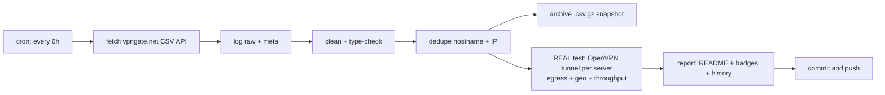

# 🛡️ VPN Gate Monitor

> **Every 6 hours** this repo fetches the complete public [VPN Gate](https://www.vpngate.net/en/) server list, **cleans, deduplicates and archives** it — and then does the part that matters: it **opens a real OpenVPN tunnel to every single listed server**, verifies that traffic genuinely exits through it, checks *where* it exits, and measures real download throughput.
>
> **Everything below this line is the auto-generated living report. No hand-edited numbers.**

[](https://github.com/G1010yzd10/vpngate-monitor/actions/workflows/vpngate.yml)
[](https://raw.githubusercontent.com/G1010yzd10/vpngate-monitor/main/badges/servers.json)
[](https://raw.githubusercontent.com/G1010yzd10/vpngate-monitor/main/badges/alive.json)
[](https://raw.githubusercontent.com/G1010yzd10/vpngate-monitor/main/badges/speed.json)
[](https://raw.githubusercontent.com/G1010yzd10/vpngate-monitor/main/badges/updated.json)

## 📊 Latest results

| | |
|---|---|
| **Run** | [#14 · view run](https://github.com/G1010yzd10/vpngate-monitor/actions/runs/37070185741) · 2026-10-02 22:01:53 UTC · trigger: `schedule` |
| **Servers fetched (unique)** | **97** |
| **Duplicates removed** | 0 exact + 0 same-IP |
| **Servers tested** | **588 of 588** — all 97 current + 491 historical (every server seen in the API within 30 days) |
| **✅ Verified alive** (tunnel up + egress proven) | **164** — 33 from the current list + 131 historical ♻️ |
| **❌ Dead / unusable** | 424 |
| **Usability** | **34.0%** of everything VPN Gate lists right now actually works |
| **⚡ Measured speed (avg / median / max)** | **12.9 / 14.0 / 97.8 Mbps** |
| **🚀 Fastest verified** | **vpn132949429** · 🇺🇸 United States · **97.8 Mbps** |
| **🧭 Exit-country mismatches** | 5 (server exits somewhere else than it claims) |
| **🤝 Handshake time (alive, avg)** | 2.7 s |

## 🚀 Fastest verified servers

| # | Server | Country | List | Endpoint | Handshake | Measured ↓ | Claimed ↓ | Score |
|---:|---|---|---|---|---:|---:|---:|---:|
| 1 | `vpn132949429` | 🇺🇸 United States | 📋 current | `47.155.228.164:1392`/udp | 2.0s | **97.8 Mbps** | 150.2 Mbps | 1,848,446 |
| 2 | `vpn908512202` | 🇺🇸 United States | ♻️ historical | `162.224.160.11:1423`/tcp | 2.0s | **79.2 Mbps** | 0.0 Mbps | 730,079 |
| 3 | `vpn705687526` | 🇯🇵 Japan | ♻️ historical | `147.192.42.21:1195`/udp | 2.3s | **26.4 Mbps** | 83.0 Mbps | 628,061 |
| 4 | `vpn201737691` | 🇯🇵 Japan | ♻️ historical | `59.85.213.123:1742`/udp | 2.3s | **25.7 Mbps** | 363.9 Mbps | 1,436,547 |
| 5 | `vpn998856828` | 🇯🇵 Japan | ♻️ historical | `60.119.230.125:1644`/udp | 2.0s | **21.9 Mbps** | 78.9 Mbps | 1,401,260 |
| 6 | `vpn506288440` | 🇯🇵 Japan | 📋 current | `59.135.150.87:1443`/udp | 2.5s | **21.9 Mbps** | 837.0 Mbps | 881,358 |
| 7 | `vpn729038920` | 🇺🇸 United States | ♻️ historical | `38.49.242.56:1538`/tcp | 2.8s | **21.1 Mbps** | 96.5 Mbps | 1,872,287 |
| 8 | `vpn922387505` | 🇰🇷 Korea Republic of | ♻️ historical | `175.209.13.17:1195`/udp | 2.5s | **20.8 Mbps** | 86.3 Mbps | 891,936 |
| 9 | `vpn584377130` | 🇯🇵 Japan | ♻️ historical | `14.14.148.93:1822`/tcp | 2.5s | **18.7 Mbps** | 70.8 Mbps | 1,493,965 |
| 10 | `vpn767479473` | 🇰🇷 Korea Republic of | 📋 current | `211.226.144.221:1195`/udp | 2.5s | **18.7 Mbps** | 78.3 Mbps | 1,366,895 |

*Measured = 5 MB download through the live tunnel to speed.cloudflare.com. Claimed = the server's self-reported line speed in the VPN Gate API. 'Historical' servers are no longer in the API's current top list but still answered our tunnel — we keep re-testing everything we have ever seen.*

## ⭐ Top-scored & verified alive

| # | Server | Country | Score | Claimed ↓ | Measured ↓ | Sessions | Uptime | Log policy |
|---:|---|---|---:|---:|---:|---:|---:|---|
| 1 | `vpn118756292` | 🇺🇸 US | 2,119,917 | 392.0 Mbps | 10.3 Mbps | 122 | 16.9 h | 2weeks |
| 2 | `vpn729038920` | 🇺🇸 US | 1,872,287 | 96.5 Mbps | 21.1 Mbps | 40 | 0.0 h | 2weeks |
| 3 | `vpn132949429` | 🇺🇸 US | 1,848,446 | 150.2 Mbps | 97.8 Mbps | 15 | 0.0 h | 2weeks |
| 4 | `vpn110639311` | 🇯🇵 JP | 1,570,348 | 63.9 Mbps | 3.4 Mbps | 68 | 8.6 d | 2weeks |
| 5 | `vpn938522983` | 🇯🇵 JP | 1,549,014 | 507.1 Mbps | 16.0 Mbps | 81 | 18.7 d | 2weeks |
| 6 | `vpn475680815` | 🇯🇵 JP | 1,518,557 | 379.2 Mbps | 14.4 Mbps | 23 | 7.7 d | 2weeks |
| 7 | `vpn788502559` | 🇯🇵 JP | 1,516,260 | 98.9 Mbps | 17.1 Mbps | 81 | 89.4 d | 2weeks |
| 8 | `vpn615046637` | 🇯🇵 JP | 1,511,254 | 188.5 Mbps | 17.9 Mbps | 83 | 26.4 d | 2weeks |
| 9 | `vpn662317581` | 🇯🇵 JP | 1,510,321 | 384.5 Mbps | 16.9 Mbps | 40 | 11.4 d | 2weeks |
| 10 | `vpn188811855` | 🇯🇵 JP | 1,509,379 | 476.9 Mbps | 17.0 Mbps | 63 | 11.7 d | 2weeks |

## 🌍 Countries

| Country | Servers | Verified alive | Best measured ↓ | Fastest server |
|---|---:|---:|---:|---|
| 🇯🇵 Japan (JP) | 287 | 74 | 26.4 Mbps | `vpn705687526` |
| 🇰🇷 Korea Republic of (KR) | 170 | 61 | 20.8 Mbps | `vpn922387505` |
| 🇹🇭 Thailand (TH) | 38 | 3 | 15.1 Mbps | `vpn622921954` |
| 🇷🇺 Russian Federation (RU) | 35 | 0 | 0.0 Mbps | `` |
| 🇺🇸 United States (US) | 20 | 7 | 97.8 Mbps | `vpn132949429` |
| 🇻🇳 Viet Nam (VN) | 9 | 5 | 13.6 Mbps | `vpn381476084` |
| 🇭🇷 Croatia (LOCAL Name: Hrvatska) (HR) | 5 | 4 | 0.8 Mbps | `vpn429922709` |
| 🇦🇷 Argentina (AR) | 3 | 2 | 14.5 Mbps | `vpn412340960` |
| 🇮🇳 India (IN) | 3 | 2 | 14.0 Mbps | `vpn213215154` |
| 🇨🇦 Canada (CA) | 2 | 1 | 16.1 Mbps | `vpn779606145` |
| 🇲🇽 Mexico (MX) | 2 | 0 | 0.0 Mbps | `` |
| 🇵🇪 Peru (PE) | 2 | 0 | 0.0 Mbps | `` |
| 🇦🇺 Australia (AU) | 1 | 1 | 0.4 Mbps | `vpn562825704` |
| 🇧🇪 Belgium (BE) | 1 | 0 | 0.0 Mbps | `` |
| 🇨🇭 Switzerland (CH) | 1 | 0 | 0.0 Mbps | `` |
| 🇨🇱 Chile (CL) | 1 | 0 | 0.0 Mbps | `` |
| 🇨🇳 China (CN) | 1 | 0 | 0.0 Mbps | `` |
| 🇨🇴 Colombia (CO) | 1 | 0 | 0.0 Mbps | `` |
| 🇪🇨 Ecuador (EC) | 1 | 1 | 15.0 Mbps | `vpn714667264` |
| 🇫🇷 France (FR) | 1 | 0 | 0.0 Mbps | `` |
| 🇬🇩 Grenada (GD) | 1 | 1 | 3.6 Mbps | `diamondgnd` |
| 🇱🇹 Lithuania (LT) | 1 | 1 | 12.3 Mbps | `vpn539804093` |
| 🇱🇺 Luxembourg (LU) | 1 | 0 | 0.0 Mbps | `` |
| 🇷🇴 Romania (RO) | 1 | 1 | 0.7 Mbps | `opengw` |

## 🕵️ Claim vs. reality

The VPN Gate `Speed` field is whatever the server *claims*. Here is the truth, measured through a live tunnel — the hall of shame (claimed ≫ delivered):

| Server | Country | Claims | Delivers | Reality ratio |
|---|---|---:|---:|---:|
| `vpn165600618` | 🇯🇵 JP | 894 Mbps | 0.5 Mbps | 0% |
| `vpn219941769` | 🇰🇷 KR | 772 Mbps | 0.5 Mbps | 0% |
| `vpn771151831` | 🇰🇷 KR | 44 Mbps | 0.1 Mbps | 0% |
| `opengw` | 🇷🇴 RO | 159 Mbps | 0.7 Mbps | 0% |
| `vpn316730005` | 🇯🇵 JP | 191 Mbps | 1.2 Mbps | 1% |
| `vpn562825704` | 🇦🇺 AU | 41 Mbps | 0.4 Mbps | 1% |
| `vpn801372263` | 🇭🇷 HR | 73 Mbps | 0.8 Mbps | 1% |
| `vpn517964018` | 🇰🇷 KR | 78 Mbps | 0.9 Mbps | 1% |
| `vpn764427404` | 🇻🇳 VN | 124 Mbps | 1.4 Mbps | 1% |
| `vpn215791012` | 🇰🇷 KR | 82 Mbps | 1.0 Mbps | 1% |

Most honest of this round: `vpn408435278` (15 Mbps), `vpn137812529` (18 Mbps), `vpn110060260` (13 Mbps), `vpn219770251` (16 Mbps), `vpn132949429` (98 Mbps).

## 🧭 Exit-country mismatches

These servers are listed under one country but your traffic **actually exits somewhere else** (verified via Cloudflare's geo view of the exit IP) — useful to know before you trust one:

| Server | Claims | Actually exits via | Exit IP | Measured ↓ |
|---|---|---|---|---:|
| `opengw` | 🇷🇴 RO | 🇯🇵 JP | `187.15.135.243` | 0.7 Mbps |
| `vpn981204829` | 🇭🇷 HR | 🇧🇬 BG | `150.40.105.12` | 0.3 Mbps |
| `vpn118469396` | 🇭🇷 HR | 🇧🇬 BG | `150.40.105.23` | 0.8 Mbps |
| `vpn429922709` | 🇭🇷 HR | 🇧🇬 BG | `150.40.105.7` | 0.8 Mbps |
| `vpn801372263` | 🇭🇷 HR | 🇧🇬 BG | `150.40.105.13` | 0.8 Mbps |

## 📈 History

Alive % trend (last 5 runs): `▇█▃▁▁`

Avg measured speed (Mbps): `▇█▁█▁`

| Run at | Fetched | Alive | Alive % | Avg ↓ | Max ↓ | Mismatches |
|---|---:|---:|---:|---:|---:|---:|
| 2026-10-02 05:01:43 UTC | 97 | 289 | 57% | 9.1 | 54.4 | 5 |
| 2026-10-01 05:13:27 UTC | 96 | 248 | 59% | 12.1 | 73.6 | 6 |
| 2026-09-30 04:59:45 UTC | 93 | 214 | 63% | 8.7 | 23.2 | 7 |
| 2026-09-29 04:50:31 UTC | 91 | 191 | 73% | 11.9 | 80.1 | 3 |
| 2026-09-29 04:45:58 UTC | 93 | 126 | 70% | 11.4 | 53.6 | 2 |

## ⚙️ How the pipeline works



1. **Fetch** — `GET /api/iphone/` with retries and endpoint fallback; responses are validated (the API sometimes serves an empty placeholder page to datacenter IPs) and the raw bytes are logged and hashed (sha256).
2. **Clean** — parse the special CSV (`*vpn_servers` marker, `#`-prefixed header), type-check every numeric field, validate IPs, drop broken rows, strip noise.
3. **Dedupe** — remove exact `(HostName, IP)` duplicates, then same-IP entries keeping the highest-scoring one.
4. **Archive** — every run writes an immutable gzipped snapshot to `archive/` (auto-pruned to the newest 360 ≈ 90 days).
5. **Test — the real deal.** For **every** server, every run — not just the API's current list, but **the union of every server that has ever appeared** within the 30-day recall window (kept in `data/known_servers.json`): decode the shared VPN Gate OpenVPN template (all servers ship the same CA + dummy client cert — verified), rebuild each server's config with its remembered `(proto, port)`, force it onto a per-worker `tun` device, disable pushed routes, pin two /32 routes through the tunnel to per-worker Cloudflare anycast IPs, wait for *Initialization Sequence Completed*, then verify egress (`cdn-cgi/trace` through the tunnel must return a foreign exit IP + real exit country) and measure a 5 MB download through the same tunnel. Up to 48 isolated tunnels run in parallel; a server that never completes the handshake is hard-killed after 25 s.
6. **Report** — this README, four live badges, `latest.json`, `summary.json` and the `history.jsonl` log are regenerated and committed by `github-actions[bot]`.

## 📁 Data files & programmatic use

All results are in this repo — hotlink them straight from `https://github.com/G1010yzd10/vpngate-monitor`:

- [`data/latest.json`](https://raw.githubusercontent.com/G1010yzd10/vpngate-monitor/main/data/latest.json) — the merged dataset: every cleaned server + its latest real test result
- [`data/servers_clean.csv`](https://raw.githubusercontent.com/G1010yzd10/vpngate-monitor/main/data/servers_clean.csv) — cleaned, deduplicated server list (no bulky config blobs)
- [`data/summary.json`](https://raw.githubusercontent.com/G1010yzd10/vpngate-monitor/main/data/summary.json) — compact run summary with failure breakdown
- [`data/history.jsonl`](https://raw.githubusercontent.com/G1010yzd10/vpngate-monitor/main/data/history.jsonl) — one JSON line per run, append-only
- [`archive/`](https://github.com/G1010yzd10/vpngate-monitor/tree/main/archive) — immutable gzipped snapshots of every run
- full logs, raw API response and per-server error details are attached to each [Actions run](https://github.com/G1010yzd10/vpngate-monitor/actions) as artifacts (30-day retention)

Grab a working VPN right now:

```bash
curl -s https://raw.githubusercontent.com/G1010yzd10/vpngate-monitor/main/data/latest.json \
  | python3 -c "import json,sys;[print(s['IP'],s['CountryShort'],s['test']['download_mbps'],'Mbps') for s in json.load(sys.stdin) if s['test'] and s['test']['alive']]" \
  | sort -k3 -nr | head
```

Field units: `Score` points · `Ping` ms · `Speed` bit/s (self-reported) · `Uptime` ms · `TotalUsers` count · `TotalTraffic` bytes · `download_mbps` Mbps (measured through the tunnel).

## 🔬 Methodology & caveats

- **Real tunnels, not CSV checks.** A server only counts as alive if OpenVPN completed its handshake *and* an HTTPS request bound to the tunnel egressed with a foreign IP. A server whose tunnel silently black-holes traffic fails the egress step and is reported dead.
- **No DNS through the VPN.** Test destinations are pinned with `curl --resolve` to per-worker Cloudflare anycast addresses, so a broken/hijacking VPN DNS can never fake a success.
- **Throughput** is one 5 MB download to `speed.cloudflare.com` through the live tunnel — a sample, not a lab measurement.
- **Vantage point**: GitHub Actions runners (Azure, usually US/EU). A server that is slow from there may be fast from your country, and vice versa.
- **Fairness**: volunteer servers are shared — measured speeds dip when many clients are connected (`NumVpnSessions` is listed).
- **Security**: test traffic is TLS to Cloudflare only; we never send anything sensitive through volunteer servers. Neither should you — assume the operator can see traffic metadata.

## ⚠️ Disclaimer

- [VPN Gate](https://www.vpngate.net/en/) is an academic experiment by the University of Tsukuba, Japan (Daiyuu Nobori & co). This project is an independent monitor of its public API and is **not affiliated** with it.
- VPN servers are run by volunteers; some keep connection logs (see `LogType`). Use them legally and responsibly; do not route anything private or illegal through them.
- Data is provided **as-is** for research/educational purposes.

## 📄 License

Code: MIT. Data: originates from VPN Gate's public API — respect their terms.

---
*Auto-generated by [run #14](https://github.com/G1010yzd10/vpngate-monitor/actions/runs/37070185741) at 2026-10-02 22:06:08 UTC. Next scheduled run: every 6h (00:00 / 06:00 / 12:00 / 18:00 UTC).*
