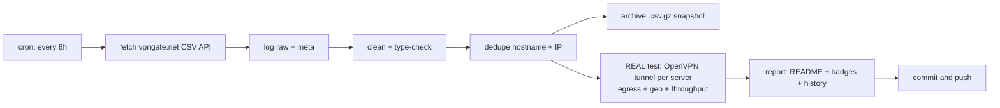

# 🛡️ VPN Gate Monitor

> **Every 6 hours** this repo fetches the complete public [VPN Gate](https://www.vpngate.net/en/) server list, **cleans, deduplicates and archives** it — and then does the part that matters: it **opens a real OpenVPN tunnel to every single listed server**, verifies that traffic genuinely exits through it, checks *where* it exits, and measures real download throughput.
>
> **Everything below this line is the auto-generated living report. No hand-edited numbers.**

[](https://github.com/G1010yzd10/vpngate-monitor/actions/workflows/vpngate.yml)
[](https://raw.githubusercontent.com/G1010yzd10/vpngate-monitor/main/badges/servers.json)
[](https://raw.githubusercontent.com/G1010yzd10/vpngate-monitor/main/badges/alive.json)
[](https://raw.githubusercontent.com/G1010yzd10/vpngate-monitor/main/badges/speed.json)
[](https://raw.githubusercontent.com/G1010yzd10/vpngate-monitor/main/badges/updated.json)

## 📊 Latest results

| | |
|---|---|
| **Run** | [#39 · view run](https://github.com/G1010yzd10/vpngate-monitor/actions/runs/37999406988) · 2026-10-09 22:28:53 UTC · trigger: `schedule` |
| **Servers fetched (unique)** | **96** |
| **Duplicates removed** | 0 exact + 0 same-IP |
| **Servers tested** | **1,785 of 1,785** — all 96 current + 1,689 historical (every server seen in the API within 30 days) |
| **✅ Verified alive** (tunnel up + egress proven) | **481** — 40 from the current list + 441 historical ♻️ |
| **❌ Dead / unusable** | 1,304 |
| **Usability** | **41.7%** of everything VPN Gate lists right now actually works |
| **⚡ Measured speed (avg / median / max)** | **11.5 / 13.8 / 28.6 Mbps** |
| **🚀 Fastest verified** | **vpn729038920** · 🇺🇸 United States · **28.6 Mbps** |
| **🧭 Exit-country mismatches** | 11 (server exits somewhere else than it claims) |
| **🤝 Handshake time (alive, avg)** | 2.9 s |

## 🚀 Fastest verified servers

| # | Server | Country | List | Endpoint | Handshake | Measured ↓ | Claimed ↓ | Score |
|---:|---|---|---|---|---:|---:|---:|---:|
| 1 | `vpn729038920` | 🇺🇸 United States | ♻️ historical | `38.49.242.56:1538`/tcp | 2.3s | **28.6 Mbps** | 96.5 Mbps | 1,872,287 |
| 2 | `vpn705687526` | 🇯🇵 Japan | 📋 current | `147.192.42.21:1195`/udp | 2.3s | **26.4 Mbps** | 68.6 Mbps | 1,446,061 |
| 3 | `vpn821116418` | 🇯🇵 Japan | ♻️ historical | `138.64.97.146:21635`/udp | 2.5s | **25.4 Mbps** | 830.0 Mbps | 579,283 |
| 4 | `vpn679218486` | 🇯🇵 Japan | ♻️ historical | `124.209.226.195:1752`/udp | 2.3s | **24.8 Mbps** | 686.9 Mbps | 597,704 |
| 5 | `vpn165481165` | 🇯🇵 Japan | ♻️ historical | `133.149.94.50:1877`/udp | 2.3s | **23.8 Mbps** | 462.8 Mbps | 990,993 |
| 6 | `vpn693017146` | 🇯🇵 Japan | ♻️ historical | `218.131.41.95:1975`/udp | 2.5s | **23.3 Mbps** | 2,558.8 Mbps | 599,858 |
| 7 | `vpn801078316` | 🇯🇵 Japan | ♻️ historical | `138.64.96.119:27783`/udp | 2.5s | **23.3 Mbps** | 288.3 Mbps | 594,948 |
| 8 | `vpn178005109` | 🇯🇵 Japan | ♻️ historical | `114.184.115.158:1848`/udp | 2.5s | **23.3 Mbps** | 640.5 Mbps | 585,823 |
| 9 | `vpn537261568` | 🇯🇵 Japan | ♻️ historical | `220.147.116.46:1508`/udp | 2.5s | **23.1 Mbps** | 39.0 Mbps | 518,084 |
| 10 | `vpn701289290` | 🇯🇵 Japan | ♻️ historical | `115.163.40.198:1195`/udp | 2.3s | **23.0 Mbps** | 844.7 Mbps | 1,005,299 |

*Measured = 5 MB download through the live tunnel to speed.cloudflare.com. Claimed = the server's self-reported line speed in the VPN Gate API. 'Historical' servers are no longer in the API's current top list but still answered our tunnel — we keep re-testing everything we have ever seen.*

## ⭐ Top-scored & verified alive

| # | Server | Country | Score | Claimed ↓ | Measured ↓ | Sessions | Uptime | Log policy |
|---:|---|---|---:|---:|---:|---:|---:|---|
| 1 | `public-vpn-48` | 🇯🇵 JP | 3,016,353 | 949.2 Mbps | 14.7 Mbps | 107 | 126.5 d | 2weeks |
| 2 | `public-vpn-64` | 🇯🇵 JP | 2,982,423 | 82.6 Mbps | 15.2 Mbps | 74 | 7.0 d | 2weeks |
| 3 | `public-vpn-145` | 🇯🇵 JP | 2,779,767 | 396.3 Mbps | 16.4 Mbps | 42 | 128.6 d | 2weeks |
| 4 | `public-vpn-259` | 🇯🇵 JP | 2,777,762 | 138.1 Mbps | 5.3 Mbps | 130 | 6.6 d | 2weeks |
| 5 | `public-vpn-100` | 🇯🇵 JP | 2,728,268 | 62.8 Mbps | 15.2 Mbps | 186 | 7.0 d | 2weeks |
| 6 | `public-vpn-134` | 🇯🇵 JP | 2,711,895 | 135.1 Mbps | 15.5 Mbps | 57 | 6.0 d | 2weeks |
| 7 | `public-vpn-196` | 🇯🇵 JP | 2,679,699 | 701.4 Mbps | 6.0 Mbps | 77 | 126.6 d | 2weeks |
| 8 | `public-vpn-197` | 🇯🇵 JP | 2,563,317 | 148.7 Mbps | 11.2 Mbps | 88 | 5.6 d | 2weeks |
| 9 | `public-vpn-187` | 🇯🇵 JP | 2,555,811 | 163.7 Mbps | 0.7 Mbps | 85 | 7.0 d | 2weeks |
| 10 | `public-vpn-51` | 🇯🇵 JP | 2,542,469 | 64.5 Mbps | 15.3 Mbps | 55 | 7.0 d | 2weeks |

## 🌍 Countries

| Country | Servers | Verified alive | Best measured ↓ | Fastest server |
|---|---:|---:|---:|---|
| 🇯🇵 Japan (JP) | 777 | 264 | 26.4 Mbps | `vpn705687526` |
| 🇰🇷 Korea Republic of (KR) | 583 | 162 | 19.9 Mbps | `vpn767479473` |
| 🇷🇺 Russian Federation (RU) | 134 | 5 | 11.5 Mbps | `vpn664659019` |
| 🇹🇭 Thailand (TH) | 127 | 10 | 15.1 Mbps | `vpn740415697` |
| 🇺🇸 United States (US) | 49 | 10 | 28.6 Mbps | `vpn729038920` |
| 🇻🇳 Viet Nam (VN) | 32 | 3 | 11.1 Mbps | `vpn764427404` |
| 🇭🇷 Croatia (LOCAL Name: Hrvatska) (HR) | 13 | 9 | 0.8 Mbps | `vpn801372263` |
| 🇲🇽 Mexico (MX) | 6 | 0 | 0.0 Mbps | `` |
| 🇦🇷 Argentina (AR) | 5 | 1 | 16.4 Mbps | `vpn510681258` |
| 🇮🇳 India (IN) | 5 | 1 | 7.6 Mbps | `vpn359610091` |
| 🇦🇺 Australia (AU) | 4 | 1 | 11.6 Mbps | `vpn759761201` |
| 🇨🇱 Chile (CL) | 4 | 1 | 11.4 Mbps | `vpn548414740` |
| 🇨🇦 Canada (CA) | 3 | 1 | 5.7 Mbps | `vpn779606145` |
| 🇨🇴 Colombia (CO) | 3 | 0 | 0.0 Mbps | `` |
| 🇵🇪 Peru (PE) | 3 | 0 | 0.0 Mbps | `` |
| 🇺🇦 Ukraine (UA) | 3 | 0 | 0.0 Mbps | `` |
| 🇦🇪 United Arab Emirates (AE) | 2 | 1 | 8.5 Mbps | `vpn490466648` |
| 🇧🇷 Brazil (BR) | 2 | 1 | 10.2 Mbps | `vpn564048942` |
| 🇨🇳 China (CN) | 2 | 1 | 6.8 Mbps | `_unregistered_vpn952021746` |
| 🇩🇪 Germany (DE) | 2 | 1 | 0.8 Mbps | `vpn695737487` |
| 🇫🇷 France (FR) | 2 | 1 | 3.8 Mbps | `vpn206344472` |
| 🇬🇧 United Kingdom (GB) | 2 | 0 | 0.0 Mbps | `` |
| 🇭🇰 Hong Kong (HK) | 2 | 2 | 11.0 Mbps | `vpn986755484` |
| 🇲🇲 Myanmar (MM) | 2 | 0 | 0.0 Mbps | `` |
| 🇧🇪 Belgium (BE) | 1 | 0 | 0.0 Mbps | `` |
| 🇧🇾 Belarus (BY) | 1 | 1 | 11.6 Mbps | `vpn339361450` |
| 🇨🇭 Switzerland (CH) | 1 | 0 | 0.0 Mbps | `` |
| 🇨🇿 Czech Republic (CZ) | 1 | 1 | 9.7 Mbps | `vpn809432043` |
| 🇪🇨 Ecuador (EC) | 1 | 0 | 0.0 Mbps | `` |
| 🇫🇮 Finland (FI) | 1 | 0 | 0.0 Mbps | `` |
| 🇬🇩 Grenada (GD) | 1 | 1 | 4.7 Mbps | `diamondgnd` |
| 🇭🇺 Hungary (HU) | 1 | 1 | 10.5 Mbps | `vpn273160004` |
| 🇮🇷 Iran (ISLAMIC Republic Of) (IR) | 1 | 0 | 0.0 Mbps | `` |
| 🇱🇨 Saint Lucia (LC) | 1 | 0 | 0.0 Mbps | `` |
| 🇱🇹 Lithuania (LT) | 1 | 1 | 11.4 Mbps | `vpn539804093` |
| 🇱🇺 Luxembourg (LU) | 1 | 0 | 0.0 Mbps | `` |
| 🇲🇾 Malaysia (MY) | 1 | 0 | 0.0 Mbps | `` |
| 🇵🇭 Philippines (PH) | 1 | 0 | 0.0 Mbps | `` |
| 🇵🇹 Portugal (PT) | 1 | 0 | 0.0 Mbps | `` |
| 🇷🇴 Romania (RO) | 1 | 0 | 0.0 Mbps | `` |
| … | +2 more countries | | | |

## 🕵️ Claim vs. reality

The VPN Gate `Speed` field is whatever the server *claims*. Here is the truth, measured through a live tunnel — the hall of shame (claimed ≫ delivered):

| Server | Country | Claims | Delivers | Reality ratio |
|---|---|---:|---:|---:|
| `vpn322426921` | 🇰🇷 KR | 467 Mbps | 0.1 Mbps | 0% |
| `vpn981288372` | 🇯🇵 JP | 263 Mbps | 0.2 Mbps | 0% |
| `vpn771151831` | 🇰🇷 KR | 44 Mbps | 0.1 Mbps | 0% |
| `vpn703005952` | 🇯🇵 JP | 241 Mbps | 0.5 Mbps | 0% |
| `public-vpn-209` | 🇯🇵 JP | 135 Mbps | 0.3 Mbps | 0% |
| `public-vpn-198` | 🇯🇵 JP | 1,352 Mbps | 3.0 Mbps | 0% |
| `vpn147772359` | 🇷🇺 RU | 213 Mbps | 0.5 Mbps | 0% |
| `vpn936512836` | 🇰🇷 KR | 476 Mbps | 1.2 Mbps | 0% |
| `public-vpn-194` | 🇯🇵 JP | 183 Mbps | 0.5 Mbps | 0% |
| `public-vpn-95` | 🇯🇵 JP | 1,304 Mbps | 4.2 Mbps | 0% |

Most honest of this round: `vpn611780108` (15 Mbps), `vpn168250961` (15 Mbps), `vpn210599978` (15 Mbps), `vpn346537516` (12 Mbps), `vpn672056740` (17 Mbps).

## 🧭 Exit-country mismatches

These servers are listed under one country but your traffic **actually exits somewhere else** (verified via Cloudflare's geo view of the exit IP) — useful to know before you trust one:

| Server | Claims | Actually exits via | Exit IP | Measured ↓ |
|---|---|---|---|---:|
| `vpn232859084` | 🇭🇷 HR | 🇧🇬 BG | `150.40.105.21` | 0.7 Mbps |
| `vpn192906546` | 🇭🇷 HR | 🇧🇬 BG | `150.40.105.16` | 0.8 Mbps |
| `vpn981204829` | 🇭🇷 HR | 🇧🇬 BG | `150.40.105.12` | 0.8 Mbps |
| `vpn265277249` | 🇭🇷 HR | 🇧🇬 BG | `150.40.105.9` | 0.7 Mbps |
| `vpn430861125` | 🇭🇷 HR | 🇧🇬 BG | `150.40.105.10` | 0.7 Mbps |
| `vpn429922709` | 🇭🇷 HR | 🇧🇬 BG | `150.40.105.7` | 0.8 Mbps |
| `vpn363342659` | 🇭🇷 HR | 🇧🇬 BG | `150.40.105.8` | 0.8 Mbps |
| `vpn256634230` | 🇭🇷 HR | 🇧🇬 BG | `150.40.105.22` | 0.7 Mbps |
| `vpn801372263` | 🇭🇷 HR | 🇧🇬 BG | `150.40.105.13` | 0.8 Mbps |
| `vpn913610646` | 🇺🇸 US | 🇭🇰 HK | `103.212.187.24` | 0.0 Mbps |
| `vpn695737487` | 🇩🇪 DE | 🇫🇮 FI | `65.109.137.25` | 0.8 Mbps |

## 📈 History

Alive % trend (last 24 runs): `██▇▆▆▁▄▅▄▃▄▁▂▃▄▂▃▃▁▂▃▁▂▃`

Avg measured speed (Mbps): `▆▇▁▇▂██▇▁▅▁▂▃▃▃▇▁▆▄▃▁▁▆▆`

| Run at | Fetched | Alive | Alive % | Avg ↓ | Max ↓ | Mismatches |
|---|---:|---:|---:|---:|---:|---:|
| 2026-10-09 12:55:41 UTC | 94 | 772 | 45% | 11.3 | 94.1 | 9 |
| 2026-10-09 05:33:49 UTC | 95 | 636 | 38% | 11.8 | 42.6 | 6 |
| 2026-10-08 23:09:27 UTC | 97 | 449 | 28% | 9.0 | 36.8 | 6 |
| 2026-10-08 13:09:03 UTC | 93 | 687 | 44% | 8.5 | 28.1 | 8 |
| 2026-10-08 05:29:25 UTC | 96 | 566 | 38% | 9.9 | 96.0 | 7 |
| 2026-10-07 22:56:49 UTC | 94 | 418 | 29% | 10.6 | 32.7 | 8 |
| 2026-10-07 13:01:45 UTC | 98 | 605 | 44% | 11.4 | 64.9 | 4 |
| 2026-10-07 05:20:12 UTC | 97 | 523 | 40% | 9.0 | 49.2 | 5 |
| 2026-10-06 22:32:59 UTC | 93 | 425 | 34% | 11.8 | 102.0 | 5 |
| 2026-10-06 13:07:16 UTC | 99 | 577 | 48% | 9.6 | 21.3 | 7 |
| 2026-10-06 05:51:24 UTC | 97 | 466 | 41% | 9.7 | 48.3 | 6 |
| 2026-10-05 23:55:39 UTC | 91 | 372 | 34% | 10.1 | 56.0 | 6 |
| 2026-10-05 19:57:29 UTC | 94 | 328 | 32% | 9.2 | 44.0 | 4 |
| 2026-10-05 14:10:31 UTC | 95 | 434 | 45% | 8.8 | 52.2 | 4 |
| 2026-10-05 05:01:08 UTC | 94 | 394 | 44% | 10.9 | 50.4 | 3 |

## ⚙️ How the pipeline works



1. **Fetch** — `GET /api/iphone/` with retries and endpoint fallback; responses are validated (the API sometimes serves an empty placeholder page to datacenter IPs) and the raw bytes are logged and hashed (sha256).
2. **Clean** — parse the special CSV (`*vpn_servers` marker, `#`-prefixed header), type-check every numeric field, validate IPs, drop broken rows, strip noise.
3. **Dedupe** — remove exact `(HostName, IP)` duplicates, then same-IP entries keeping the highest-scoring one.
4. **Archive** — every run writes an immutable gzipped snapshot to `archive/` (auto-pruned to the newest 360 ≈ 90 days).
5. **Test — the real deal.** For **every** server, every run — not just the API's current list, but **the union of every server that has ever appeared** within the 30-day recall window (kept in `data/known_servers.json`): decode the shared VPN Gate OpenVPN template (all servers ship the same CA + dummy client cert — verified), rebuild each server's config with its remembered `(proto, port)`, force it onto a per-worker `tun` device, disable pushed routes, pin two /32 routes through the tunnel to per-worker Cloudflare anycast IPs, wait for *Initialization Sequence Completed*, then verify egress (`cdn-cgi/trace` through the tunnel must return a foreign exit IP + real exit country) and measure a 5 MB download through the same tunnel. Up to 48 isolated tunnels run in parallel; a server that never completes the handshake is hard-killed after 25 s.
6. **Report** — this README, four live badges, `latest.json`, `summary.json` and the `history.jsonl` log are regenerated and committed by `github-actions[bot]`.

## 📁 Data files & programmatic use

All results are in this repo — hotlink them straight from `https://github.com/G1010yzd10/vpngate-monitor`:

- [`data/latest.json`](https://raw.githubusercontent.com/G1010yzd10/vpngate-monitor/main/data/latest.json) — the merged dataset: every cleaned server + its latest real test result
- [`data/servers_clean.csv`](https://raw.githubusercontent.com/G1010yzd10/vpngate-monitor/main/data/servers_clean.csv) — cleaned, deduplicated server list (no bulky config blobs)
- [`data/summary.json`](https://raw.githubusercontent.com/G1010yzd10/vpngate-monitor/main/data/summary.json) — compact run summary with failure breakdown
- [`data/history.jsonl`](https://raw.githubusercontent.com/G1010yzd10/vpngate-monitor/main/data/history.jsonl) — one JSON line per run, append-only
- [`archive/`](https://github.com/G1010yzd10/vpngate-monitor/tree/main/archive) — immutable gzipped snapshots of every run
- full logs, raw API response and per-server error details are attached to each [Actions run](https://github.com/G1010yzd10/vpngate-monitor/actions) as artifacts (30-day retention)

Grab a working VPN right now:

```bash
curl -s https://raw.githubusercontent.com/G1010yzd10/vpngate-monitor/main/data/latest.json \
  | python3 -c "import json,sys;[print(s['IP'],s['CountryShort'],s['test']['download_mbps'],'Mbps') for s in json.load(sys.stdin) if s['test'] and s['test']['alive']]" \
  | sort -k3 -nr | head
```

Field units: `Score` points · `Ping` ms · `Speed` bit/s (self-reported) · `Uptime` ms · `TotalUsers` count · `TotalTraffic` bytes · `download_mbps` Mbps (measured through the tunnel).

## 🔬 Methodology & caveats

- **Real tunnels, not CSV checks.** A server only counts as alive if OpenVPN completed its handshake *and* an HTTPS request bound to the tunnel egressed with a foreign IP. A server whose tunnel silently black-holes traffic fails the egress step and is reported dead.
- **No DNS through the VPN.** Test destinations are pinned with `curl --resolve` to per-worker Cloudflare anycast addresses, so a broken/hijacking VPN DNS can never fake a success.
- **Throughput** is one 5 MB download to `speed.cloudflare.com` through the live tunnel — a sample, not a lab measurement.
- **Vantage point**: GitHub Actions runners (Azure, usually US/EU). A server that is slow from there may be fast from your country, and vice versa.
- **Fairness**: volunteer servers are shared — measured speeds dip when many clients are connected (`NumVpnSessions` is listed).
- **Security**: test traffic is TLS to Cloudflare only; we never send anything sensitive through volunteer servers. Neither should you — assume the operator can see traffic metadata.

## ⚠️ Disclaimer

- [VPN Gate](https://www.vpngate.net/en/) is an academic experiment by the University of Tsukuba, Japan (Daiyuu Nobori & co). This project is an independent monitor of its public API and is **not affiliated** with it.
- VPN servers are run by volunteers; some keep connection logs (see `LogType`). Use them legally and responsibly; do not route anything private or illegal through them.
- Data is provided **as-is** for research/educational purposes.

## 📄 License

Code: MIT. Data: originates from VPN Gate's public API — respect their terms.

---
*Auto-generated by [run #39](https://github.com/G1010yzd10/vpngate-monitor/actions/runs/37999406988) at 2026-10-09 22:41:27 UTC. Next scheduled run: every 6h (00:00 / 06:00 / 12:00 / 18:00 UTC).*
