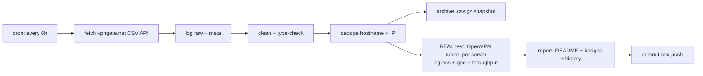

# 🛡️ VPN Gate Monitor

> **Every 6 hours** this repo fetches the complete public [VPN Gate](https://www.vpngate.net/en/) server list, **cleans, deduplicates and archives** it — and then does the part that matters: it **opens a real OpenVPN tunnel to every single listed server**, verifies that traffic genuinely exits through it, checks *where* it exits, and measures real download throughput.
>
> **Everything below this line is the auto-generated living report. No hand-edited numbers.**

[](https://github.com/G1010yzd10/vpngate-monitor/actions/workflows/vpngate.yml)
[](https://raw.githubusercontent.com/G1010yzd10/vpngate-monitor/main/badges/servers.json)
[](https://raw.githubusercontent.com/G1010yzd10/vpngate-monitor/main/badges/alive.json)
[](https://raw.githubusercontent.com/G1010yzd10/vpngate-monitor/main/badges/speed.json)
[](https://raw.githubusercontent.com/G1010yzd10/vpngate-monitor/main/badges/updated.json)

## 📊 Latest results

| | |
|---|---|
| **Run** | [#37 · view run](https://github.com/G1010yzd10/vpngate-monitor/actions/runs/37889093248) · 2026-10-09 05:33:49 UTC · trigger: `schedule` |
| **Servers fetched (unique)** | **95** |
| **Duplicates removed** | 0 exact + 1 same-IP |
| **Servers tested** | **1,668 of 1,668** — all 95 current + 1,573 historical (every server seen in the API within 30 days) |
| **✅ Verified alive** (tunnel up + egress proven) | **636** — 67 from the current list + 569 historical ♻️ |
| **❌ Dead / unusable** | 1,032 |
| **Usability** | **70.5%** of everything VPN Gate lists right now actually works |
| **⚡ Measured speed (avg / median / max)** | **11.7 / 13.4 / 42.6 Mbps** |
| **🚀 Fastest verified** | **vpn908512202** · 🇺🇸 United States · **42.6 Mbps** |
| **🧭 Exit-country mismatches** | 6 (server exits somewhere else than it claims) |
| **🤝 Handshake time (alive, avg)** | 2.9 s |

## 🚀 Fastest verified servers

| # | Server | Country | List | Endpoint | Handshake | Measured ↓ | Claimed ↓ | Score |
|---:|---|---|---|---|---:|---:|---:|---:|
| 1 | `vpn908512202` | 🇺🇸 United States | ♻️ historical | `162.224.160.11:1423`/tcp | 2.0s | **42.6 Mbps** | 0.0 Mbps | 730,079 |
| 2 | `vpn526181119` | 🇺🇸 United States | ♻️ historical | `46.110.212.225:4822`/udp | 2.3s | **32.2 Mbps** | 399.4 Mbps | 1,470,909 |
| 3 | `vpn918840683` | 🇺🇸 United States | ♻️ historical | `38.34.239.132:1245`/tcp | 3.5s | **27.5 Mbps** | 348.6 Mbps | 4,066,296 |
| 4 | `vpn325696545` | 🇯🇵 Japan | ♻️ historical | `39.111.138.50:1195`/udp | 2.5s | **26.6 Mbps** | 728.3 Mbps | 362,807 |
| 5 | `vpn679218486` | 🇯🇵 Japan | ♻️ historical | `124.209.226.195:1752`/udp | 2.5s | **24.9 Mbps** | 686.9 Mbps | 597,704 |
| 6 | `vpn751506395` | 🇯🇵 Japan | 📋 current | `219.104.167.40:14992`/udp | 2.3s | **24.5 Mbps** | 961.6 Mbps | 620,637 |
| 7 | `vpn821116418` | 🇯🇵 Japan | 📋 current | `138.64.97.146:21635`/udp | 2.3s | **24.5 Mbps** | 830.0 Mbps | 579,283 |
| 8 | `vpn736046374` | 🇯🇵 Japan | ♻️ historical | `92.202.136.79:1497`/udp | 2.5s | **24.2 Mbps** | 501.0 Mbps | 1,394,745 |
| 9 | `vpn169318955` | 🇯🇵 Japan | ♻️ historical | `138.64.86.41:52295`/udp | 2.5s | **24.1 Mbps** | 644.4 Mbps | 717,595 |
| 10 | `vpn525554372` | 🇯🇵 Japan | ♻️ historical | `101.142.196.72:1612`/udp | 2.3s | **23.4 Mbps** | 527.7 Mbps | 676,335 |

*Measured = 5 MB download through the live tunnel to speed.cloudflare.com. Claimed = the server's self-reported line speed in the VPN Gate API. 'Historical' servers are no longer in the API's current top list but still answered our tunnel — we keep re-testing everything we have ever seen.*

## ⭐ Top-scored & verified alive

| # | Server | Country | Score | Claimed ↓ | Measured ↓ | Sessions | Uptime | Log policy |
|---:|---|---|---:|---:|---:|---:|---:|---|
| 1 | `vpn918840683` | 🇺🇸 US | 4,066,296 | 348.6 Mbps | 27.5 Mbps | 208 | 22.9 d | 2weeks |
| 2 | `public-vpn-48` | 🇯🇵 JP | 3,016,353 | 949.2 Mbps | 11.7 Mbps | 107 | 126.5 d | 2weeks |
| 3 | `public-vpn-182` | 🇯🇵 JP | 2,781,744 | 1,013.3 Mbps | 5.1 Mbps | 119 | 129.6 d | 2weeks |
| 4 | `public-vpn-145` | 🇯🇵 JP | 2,779,767 | 396.3 Mbps | 11.7 Mbps | 42 | 128.6 d | 2weeks |
| 5 | `public-vpn-66` | 🇯🇵 JP | 2,758,587 | 393.6 Mbps | 13.2 Mbps | 109 | 126.6 d | 2weeks |
| 6 | `public-vpn-155` | 🇯🇵 JP | 2,714,026 | 349.5 Mbps | 16.2 Mbps | 44 | 126.6 d | 2weeks |
| 7 | `public-vpn-134` | 🇯🇵 JP | 2,711,895 | 135.1 Mbps | 15.5 Mbps | 57 | 6.0 d | 2weeks |
| 8 | `public-vpn-82` | 🇯🇵 JP | 2,529,472 | 136.8 Mbps | 16.2 Mbps | 72 | 5.6 d | 2weeks |
| 9 | `public-vpn-258` | 🇯🇵 JP | 2,453,904 | 163.1 Mbps | 14.2 Mbps | 77 | 6.0 d | 2weeks |
| 10 | `public-vpn-261` | 🇯🇵 JP | 2,431,377 | 194.5 Mbps | 2.6 Mbps | 92 | 5.0 d | 2weeks |

## 🌍 Countries

| Country | Servers | Verified alive | Best measured ↓ | Fastest server |
|---|---:|---:|---:|---|
| 🇯🇵 Japan (JP) | 735 | 318 | 26.6 Mbps | `vpn325696545` |
| 🇰🇷 Korea Republic of (KR) | 537 | 252 | 19.1 Mbps | `vpn767479473` |
| 🇷🇺 Russian Federation (RU) | 125 | 2 | 12.8 Mbps | `vpn310756240` |
| 🇹🇭 Thailand (TH) | 119 | 18 | 14.4 Mbps | `vpn740415697` |
| 🇺🇸 United States (US) | 48 | 17 | 42.6 Mbps | `vpn908512202` |
| 🇻🇳 Viet Nam (VN) | 30 | 7 | 9.4 Mbps | `vpn268153810` |
| 🇭🇷 Croatia (LOCAL Name: Hrvatska) (HR) | 7 | 4 | 0.9 Mbps | `vpn981204829` |
| 🇲🇽 Mexico (MX) | 6 | 0 | 0.0 Mbps | `` |
| 🇦🇷 Argentina (AR) | 5 | 1 | 14.8 Mbps | `vpn103123741` |
| 🇮🇳 India (IN) | 5 | 1 | 4.2 Mbps | `vpn359610091` |
| 🇦🇺 Australia (AU) | 4 | 2 | 2.3 Mbps | `vpn759761201` |
| 🇨🇱 Chile (CL) | 4 | 1 | 12.3 Mbps | `vpn548414740` |
| 🇨🇦 Canada (CA) | 3 | 2 | 20.7 Mbps | `vpn491348575` |
| 🇨🇴 Colombia (CO) | 3 | 0 | 0.0 Mbps | `` |
| 🇵🇪 Peru (PE) | 3 | 0 | 0.0 Mbps | `` |
| 🇧🇷 Brazil (BR) | 2 | 0 | 0.0 Mbps | `` |
| 🇨🇳 China (CN) | 2 | 1 | 1.1 Mbps | `_unregistered_vpn952021746` |
| 🇩🇪 Germany (DE) | 2 | 1 | 0.9 Mbps | `vpn695737487` |
| 🇫🇷 France (FR) | 2 | 0 | 0.0 Mbps | `` |
| 🇬🇧 United Kingdom (GB) | 2 | 0 | 0.0 Mbps | `` |
| 🇲🇲 Myanmar (MM) | 2 | 0 | 0.0 Mbps | `` |
| 🇺🇦 Ukraine (UA) | 2 | 1 | 11.5 Mbps | `vpn313985146` |
| 🇦🇪 United Arab Emirates (AE) | 1 | 0 | 0.0 Mbps | `` |
| 🇧🇪 Belgium (BE) | 1 | 0 | 0.0 Mbps | `` |
| 🇧🇾 Belarus (BY) | 1 | 1 | 12.3 Mbps | `vpn339361450` |
| 🇨🇭 Switzerland (CH) | 1 | 0 | 0.0 Mbps | `` |
| 🇨🇿 Czech Republic (CZ) | 1 | 0 | 0.0 Mbps | `` |
| 🇪🇨 Ecuador (EC) | 1 | 1 | 15.8 Mbps | `vpn714667264` |
| 🇫🇮 Finland (FI) | 1 | 0 | 0.0 Mbps | `` |
| 🇬🇩 Grenada (GD) | 1 | 0 | 0.0 Mbps | `` |
| 🇭🇰 Hong Kong (HK) | 1 | 1 | 5.2 Mbps | `vpn986755484` |
| 🇭🇺 Hungary (HU) | 1 | 1 | 11.5 Mbps | `vpn273160004` |
| 🇮🇷 Iran (ISLAMIC Republic Of) (IR) | 1 | 0 | 0.0 Mbps | `` |
| 🇱🇨 Saint Lucia (LC) | 1 | 0 | 0.0 Mbps | `` |
| 🇱🇹 Lithuania (LT) | 1 | 1 | 12.7 Mbps | `vpn539804093` |
| 🇱🇺 Luxembourg (LU) | 1 | 0 | 0.0 Mbps | `` |
| 🇲🇾 Malaysia (MY) | 1 | 1 | 11.2 Mbps | `vpn919050053` |
| 🇵🇭 Philippines (PH) | 1 | 0 | 0.0 Mbps | `` |
| 🇵🇹 Portugal (PT) | 1 | 1 | 15.4 Mbps | `vpn554714541` |
| 🇷🇴 Romania (RO) | 1 | 0 | 0.0 Mbps | `` |
| … | +2 more countries | | | |

## 🕵️ Claim vs. reality

The VPN Gate `Speed` field is whatever the server *claims*. Here is the truth, measured through a live tunnel — the hall of shame (claimed ≫ delivered):

| Server | Country | Claims | Delivers | Reality ratio |
|---|---|---:|---:|---:|
| `vpn981288372` | 🇯🇵 JP | 263 Mbps | 0.1 Mbps | 0% |
| `vpn517964018` | 🇰🇷 KR | 59 Mbps | 0.1 Mbps | 0% |
| `vpn771151831` | 🇰🇷 KR | 44 Mbps | 0.1 Mbps | 0% |
| `vpn508092890` | 🇰🇷 KR | 37 Mbps | 0.1 Mbps | 0% |
| `vpn779820187` | 🇯🇵 JP | 831 Mbps | 2.5 Mbps | 0% |
| `public-vpn-157` | 🇯🇵 JP | 4,732 Mbps | 16.2 Mbps | 0% |
| `vpn755967672` | 🇯🇵 JP | 130 Mbps | 0.6 Mbps | 0% |
| `vpn179486838` | 🇰🇷 KR | 756 Mbps | 3.7 Mbps | 0% |
| `public-vpn-182` | 🇯🇵 JP | 1,013 Mbps | 5.1 Mbps | 1% |
| `vpn434817190` | 🇦🇺 AU | 348 Mbps | 1.9 Mbps | 1% |

Most honest of this round: `vpn977456594` (15 Mbps), `vpn611780108` (14 Mbps), `vpn168250961` (15 Mbps), `vpn293598259` (13 Mbps), `vpn346537516` (15 Mbps).

## 🧭 Exit-country mismatches

These servers are listed under one country but your traffic **actually exits somewhere else** (verified via Cloudflare's geo view of the exit IP) — useful to know before you trust one:

| Server | Claims | Actually exits via | Exit IP | Measured ↓ |
|---|---|---|---|---:|
| `vpn429922709` | 🇭🇷 HR | 🇧🇬 BG | `150.40.105.7` | 0.9 Mbps |
| `vpn801372263` | 🇭🇷 HR | 🇧🇬 BG | `150.40.105.13` | 0.9 Mbps |
| `vpn981204829` | 🇭🇷 HR | 🇧🇬 BG | `150.40.105.12` | 0.9 Mbps |
| `vpn913610646` | 🇺🇸 US | 🇭🇰 HK | `103.212.187.24` | 0.5 Mbps |
| `vpn192906546` | 🇭🇷 HR | 🇧🇬 BG | `150.40.105.16` | 0.8 Mbps |
| `vpn695737487` | 🇩🇪 DE | 🇫🇮 FI | `65.109.137.25` | 0.9 Mbps |

## 📈 History

Alive % trend (last 22 runs): `██▇▆▆▁▄▅▄▃▄▁▂▃▄▂▃▃▁▂▃▁`

Avg measured speed (Mbps): `▆▇▁▇▂██▇▁▅▁▂▃▃▃▇▁▆▄▃▁▁`

| Run at | Fetched | Alive | Alive % | Avg ↓ | Max ↓ | Mismatches |
|---|---:|---:|---:|---:|---:|---:|
| 2026-10-08 23:09:27 UTC | 97 | 449 | 28% | 9.0 | 36.8 | 6 |
| 2026-10-08 13:09:03 UTC | 93 | 687 | 44% | 8.5 | 28.1 | 8 |
| 2026-10-08 05:29:25 UTC | 96 | 566 | 38% | 9.9 | 96.0 | 7 |
| 2026-10-07 22:56:49 UTC | 94 | 418 | 29% | 10.6 | 32.7 | 8 |
| 2026-10-07 13:01:45 UTC | 98 | 605 | 44% | 11.4 | 64.9 | 4 |
| 2026-10-07 05:20:12 UTC | 97 | 523 | 40% | 9.0 | 49.2 | 5 |
| 2026-10-06 22:32:59 UTC | 93 | 425 | 34% | 11.8 | 102.0 | 5 |
| 2026-10-06 13:07:16 UTC | 99 | 577 | 48% | 9.6 | 21.3 | 7 |
| 2026-10-06 05:51:24 UTC | 97 | 466 | 41% | 9.7 | 48.3 | 6 |
| 2026-10-05 23:55:39 UTC | 91 | 372 | 34% | 10.1 | 56.0 | 6 |
| 2026-10-05 19:57:29 UTC | 94 | 328 | 32% | 9.2 | 44.0 | 4 |
| 2026-10-05 14:10:31 UTC | 95 | 434 | 45% | 8.8 | 52.2 | 4 |
| 2026-10-05 05:01:08 UTC | 94 | 394 | 44% | 10.9 | 50.4 | 3 |
| 2026-10-03 16:01:20 UTC | 98 | 368 | 45% | 8.8 | 33.1 | 4 |
| 2026-10-03 11:25:01 UTC | 99 | 388 | 52% | 11.8 | 37.9 | 5 |

## ⚙️ How the pipeline works



1. **Fetch** — `GET /api/iphone/` with retries and endpoint fallback; responses are validated (the API sometimes serves an empty placeholder page to datacenter IPs) and the raw bytes are logged and hashed (sha256).
2. **Clean** — parse the special CSV (`*vpn_servers` marker, `#`-prefixed header), type-check every numeric field, validate IPs, drop broken rows, strip noise.
3. **Dedupe** — remove exact `(HostName, IP)` duplicates, then same-IP entries keeping the highest-scoring one.
4. **Archive** — every run writes an immutable gzipped snapshot to `archive/` (auto-pruned to the newest 360 ≈ 90 days).
5. **Test — the real deal.** For **every** server, every run — not just the API's current list, but **the union of every server that has ever appeared** within the 30-day recall window (kept in `data/known_servers.json`): decode the shared VPN Gate OpenVPN template (all servers ship the same CA + dummy client cert — verified), rebuild each server's config with its remembered `(proto, port)`, force it onto a per-worker `tun` device, disable pushed routes, pin two /32 routes through the tunnel to per-worker Cloudflare anycast IPs, wait for *Initialization Sequence Completed*, then verify egress (`cdn-cgi/trace` through the tunnel must return a foreign exit IP + real exit country) and measure a 5 MB download through the same tunnel. Up to 48 isolated tunnels run in parallel; a server that never completes the handshake is hard-killed after 25 s.
6. **Report** — this README, four live badges, `latest.json`, `summary.json` and the `history.jsonl` log are regenerated and committed by `github-actions[bot]`.

## 📁 Data files & programmatic use

All results are in this repo — hotlink them straight from `https://github.com/G1010yzd10/vpngate-monitor`:

- [`data/latest.json`](https://raw.githubusercontent.com/G1010yzd10/vpngate-monitor/main/data/latest.json) — the merged dataset: every cleaned server + its latest real test result
- [`data/servers_clean.csv`](https://raw.githubusercontent.com/G1010yzd10/vpngate-monitor/main/data/servers_clean.csv) — cleaned, deduplicated server list (no bulky config blobs)
- [`data/summary.json`](https://raw.githubusercontent.com/G1010yzd10/vpngate-monitor/main/data/summary.json) — compact run summary with failure breakdown
- [`data/history.jsonl`](https://raw.githubusercontent.com/G1010yzd10/vpngate-monitor/main/data/history.jsonl) — one JSON line per run, append-only
- [`archive/`](https://github.com/G1010yzd10/vpngate-monitor/tree/main/archive) — immutable gzipped snapshots of every run
- full logs, raw API response and per-server error details are attached to each [Actions run](https://github.com/G1010yzd10/vpngate-monitor/actions) as artifacts (30-day retention)

Grab a working VPN right now:

```bash
curl -s https://raw.githubusercontent.com/G1010yzd10/vpngate-monitor/main/data/latest.json \
  | python3 -c "import json,sys;[print(s['IP'],s['CountryShort'],s['test']['download_mbps'],'Mbps') for s in json.load(sys.stdin) if s['test'] and s['test']['alive']]" \
  | sort -k3 -nr | head
```

Field units: `Score` points · `Ping` ms · `Speed` bit/s (self-reported) · `Uptime` ms · `TotalUsers` count · `TotalTraffic` bytes · `download_mbps` Mbps (measured through the tunnel).

## 🔬 Methodology & caveats

- **Real tunnels, not CSV checks.** A server only counts as alive if OpenVPN completed its handshake *and* an HTTPS request bound to the tunnel egressed with a foreign IP. A server whose tunnel silently black-holes traffic fails the egress step and is reported dead.
- **No DNS through the VPN.** Test destinations are pinned with `curl --resolve` to per-worker Cloudflare anycast addresses, so a broken/hijacking VPN DNS can never fake a success.
- **Throughput** is one 5 MB download to `speed.cloudflare.com` through the live tunnel — a sample, not a lab measurement.
- **Vantage point**: GitHub Actions runners (Azure, usually US/EU). A server that is slow from there may be fast from your country, and vice versa.
- **Fairness**: volunteer servers are shared — measured speeds dip when many clients are connected (`NumVpnSessions` is listed).
- **Security**: test traffic is TLS to Cloudflare only; we never send anything sensitive through volunteer servers. Neither should you — assume the operator can see traffic metadata.

## ⚠️ Disclaimer

- [VPN Gate](https://www.vpngate.net/en/) is an academic experiment by the University of Tsukuba, Japan (Daiyuu Nobori & co). This project is an independent monitor of its public API and is **not affiliated** with it.
- VPN servers are run by volunteers; some keep connection logs (see `LogType`). Use them legally and responsibly; do not route anything private or illegal through them.
- Data is provided **as-is** for research/educational purposes.

## 📄 License

Code: MIT. Data: originates from VPN Gate's public API — respect their terms.

---
*Auto-generated by [run #37](https://github.com/G1010yzd10/vpngate-monitor/actions/runs/37889093248) at 2026-10-09 05:44:28 UTC. Next scheduled run: every 6h (00:00 / 06:00 / 12:00 / 18:00 UTC).*
